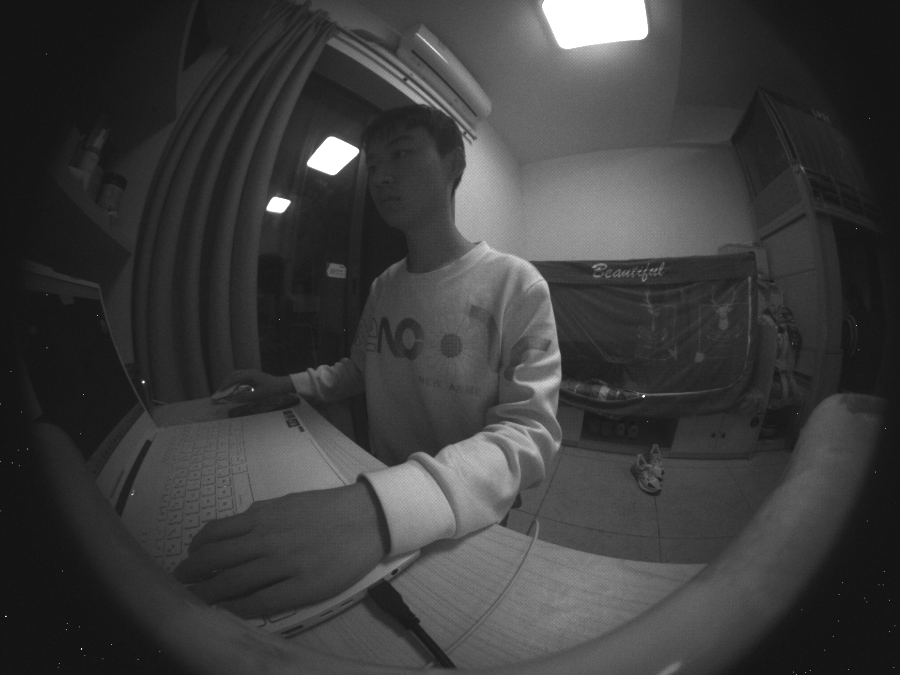
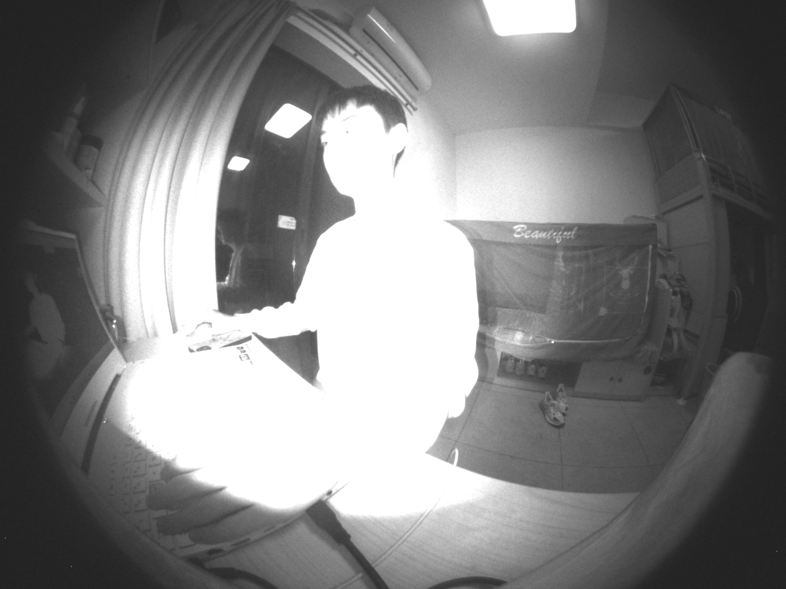

# RGB-IR Image Signal Processing Pipeline

 [](https://www.python.org/downloads/release/python-390/) [](https://github.com/QiuJueqin/fast-openISP)

The RGB-IR Image Signal Processing Pipeline is a graphics project (CSC4140) @CUHKSZ. This project extends the functionality of the fast-openISP repository by [Qiu Jueqin](https://github.com/QiuJueqin) by integrating support for processing RGB-IR images. Currently, the extended pipeline expects a 4x4 dense RGB-IR sensor kernel to operate on. 
![[Pasted image 20230523142825.png]](docs/Pasted%20image%2020230523142825.png)
The pipeline allows for efficient and accurate processing of images captured using RGB-IR cameras, enhancing the overall quality and extracting valuable information from the input.

## Table of Contents

-   [Introduction](#introduction)
-   [Modifications](#modifications)
-   [Installation](#installation)
-   [Running](#running)
-   [License](#license)

## Introduction

The RGB-IR ISP Pipeline is a project designed to expand the capabilities of the existing fast-openISP repository, enabling it to process RGB-IR image data. Following the original repository, the image data is operated on via numpy to enable fast processing. The image processing pipeline follows the implementation of the standard [openISP](https://github.com/cruxopen/openISP) project.

![[Pasted image 20230523143723.png]](docs/Pasted%20image%2020230523143723.png)
Details on the specific module operations can be found [here](https://github.com/cruxopen/openISP/blob/master/docs/Image%20Signal%20Processor.pdf).

## Modifications

The main implementation idea can be found in Yeong-Kang Lai, Yao-Hsien Huang, and Yeong-Lin Lai's paper [here](https://ieeexplore.ieee.org/document/10043554) . The overarching idea is to transform the dense 4x4 RGB-IR kernel into the standard BGGR bayer pattern in the pipeline. This job is performed by the RGBIR module found in `modules/rgbir.py`. The module takes in three configuration settings called `red_cut`, `green_cut`, and `blue_cut` which can be adjusted in the configuration `.yaml` file.

This module is placed after Anti-aliasing Filter (aaf) and before the auto-white balance (awb). The transformation should take place before auto-white balancing to preserve the black and light tones in the generated IR image output. 

### The RBGIR Module

The RGBIR module executes on the bayer matrix by interpolating IR values to red values and red values to blue values. The IR-to-red interpolation takes every IR pixel and averages the nearby red diagonals. This will then act as the red pixel in a BGGR bayer pattern. 
>This interpolation has a special edge case at the bottom right corner as can be seen. To handle this edge case, we just keep the original IR value in this position.

![[Pasted image 20230523145755.png]](docs/Pasted%20image%2020230523145755.png)
The red-to-blue interpolation follows a similar logic. It takes every red pixel and averages the nearby blue pixels.
![[Pasted image 20230523145937.png]](docs/Pasted%20image%2020230523145937.png)

### IR cutting
Afterwards, we perform an IR cut from all the pixels of the transformed BGGR bayer pattern, where
```
R' = R - red_coef * IR
G' = G - green_coef * IR
B' = B - blue_coef * IR
```
To perform the IR cut, we first extract the IR values from the initial RGB-IR bayer matrix. This is done by a helper array called IRC which is called right before the RGBIR module. Additionally, the IRC module also clips high IR values determined by an adjustable clipping coefficient. Increasing this coefficient means trading some chrome noise for better color accuracy.

The IR cut is performed in a 2x2 BGGR bayer kernel, where the IR of every 2x2 in the original RGBIR pattern is used to decrease the R, G, and B values in said kernel. The coefficients are adjustable to generate the best output image.

### Guided Upsampling by Gaussian Filter
The extended pipeline will also process an IR image. The IR image processing occurs at the end of the pipeline called by the IRG module. This module upsamples the extracted IR pixels to write to the output. The upsampling performed is guided upsampling by a Gaussian Filter. We use the finished rgb image as a guide to upsample the IR image. The algorithm works by applying a gaussian filter to the reference image to get a guidance map to preserve details in our upsampling. By using the guidance image as a reference, guided upsampling by Gaussian filtering can help preserve important features, such as edges and textures, while reducing artifacts that may be introduced during traditional upsampling methods. It is commonly used in applications such as image super-resolution and enhancing the quality of low-resolution images.

## Installation

To use the RGB-IR ISP Pipeline, follow these steps:

1.  Clone this repository to your local machine:
    
    `https://github.com/BlazedEngima/fast-openISP.git`
    
2.  Install the required dependencies:
    
    `pip install -r requirements.txt`
    

## Running

To process RGB-IR images using the pipeline, follow these steps:

1.  Run the RGBIR demo file
    
    `py demo_rgbir.py`
    

## License

This project is licensed under the MIT License. See the [LICENSE](https://mit-license.org/) file for more details.

## Output
   

---
**Note:** The Fast-OpenISP repository, which this project extends, is licensed separately. Please refer to its documentation for licensing information.